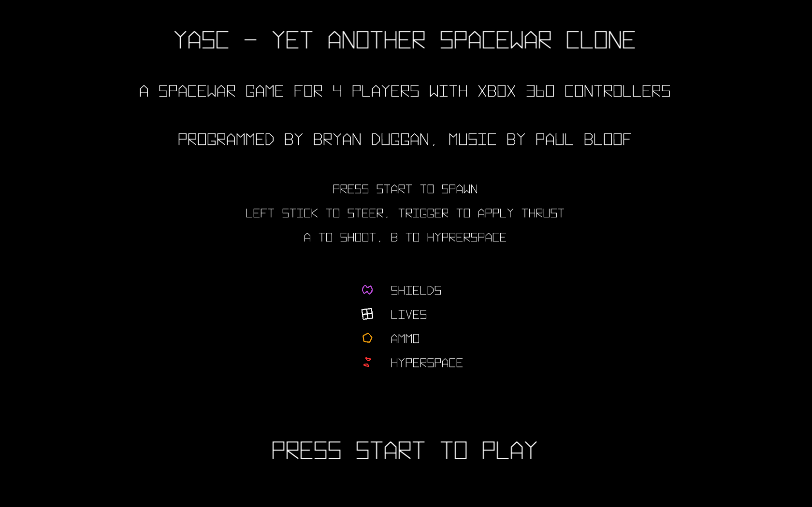
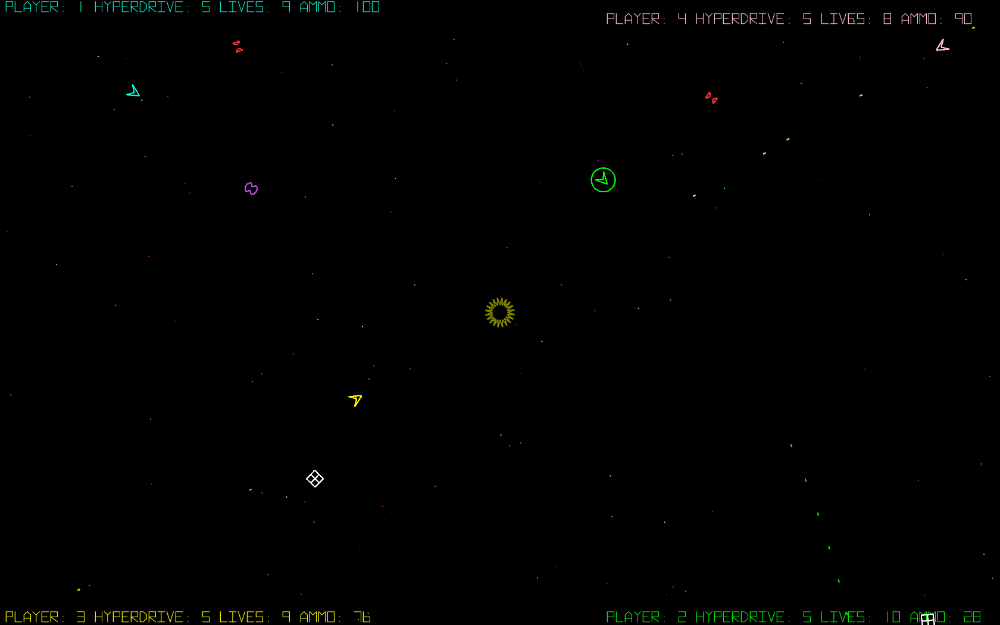
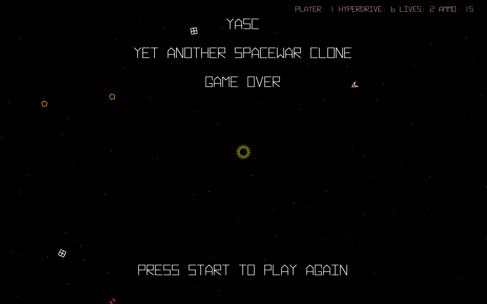

YASC
====

YASC is a fast-paced deathmatch style game for up to 4 players inspired by Spacewar. Each player spawns in a different corner of the screen. Bullets and the players wrap around the screen creating interesting gameplay strategies. Players must acquire ammo, lives and shields to survive. The sun in the center of the screen pulls everything towards it.

YASC requires XBOX 360 controllers to play.

YASC is written in Processing.

[Download the game on itch!](https://skooter500.itch.io/yasc)

